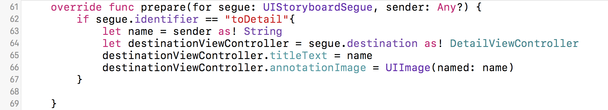

In order to allow our app to request for user location, we have to add following key-value pair to our info.plist.

```
Key : Privacy - Location When In Use Usage Description
Type : String
Value : Find places in SF
```


# Create our Annotation.Swift class

We use Annotation.Swift file to represent our Annotation class.
Copy and paste the following code into your Annotation.Swift file.

```
import UIKit
import CoreLocation
import MapKit
class Annotation: NSObject, MKAnnotation {
    var coordinate: CLLocationCoordinate2D
    var title: String?

    init(coordinate: CLLocationCoordinate2D, title: String) {
        self.coordinate = coordinate
        self.title = title
    }
}
```

# Create a CLLocationManager global variable

Create a CLLocationManager global variable inside ViewController.Swift file.

```
let locateManage = CLLocationManager()
```


# Setup UI in viewDidLoad

Add all the following codes to your viewDidLoad method

## Request to get user location :

If locationServicesEnabled, we will request WhenInUseAuthorization from user.

```
if CLLocationManager.locationServicesEnabled() {
    locateManage.requestWhenInUseAuthorization()
}

```

## Setup location manager :

We assign the locateManage delegate to ourself and startUpdatingLocation

```
//-------------CLLocationManager-------------
self.locateManage.delegate = self
//Don't worry if you get error in the above line, because we haven't implement the CLLocationManagerDelegate yet!
self.locateManage.startUpdatingLocation()//startUpdatingLocation
```

## Set a default zoom region for mapView :

We set a default zoom region to our mapView. And then showsUserLocation

```
let zoomRegion = MKCoordinateRegionMakeWithDistance(CLLocationCoordinate2D(latitude: 38.8833, longitude: -77.0167), 10000000, 10000000)
self.mapView.setRegion(zoomRegion, animated: true)
mapView.delegate = self
//Don't worry if you get error in the above line, because we haven't implement the MKMapViewDelegate yet!
mapView.mapType = MKMapType.standard
//Show user location
self.mapView.showsUserLocation = true
```

## Add all of our annotations :

The following code adds annotations to our mapView

```
//Add annotations
for name in names {
    let coordinate = CLLocationCoordinate2DMake(name.value.0, name.value.1)
    let annotation = Annotation(coordinate: coordinate,title:name.key)
    self.mapView.addAnnotation(annotation)
}
```

## In the end, you viewDidLoad method will look like this :
```
override func viewDidLoad() {
        super.viewDidLoad()

        if CLLocationManager.locationServicesEnabled() {
            locateManage.requestWhenInUseAuthorization()
        }

        //-------------CLLocationManager-------------
        self.locateManage.delegate = self
        self.locateManage.startUpdatingLocation()//startUpdatingLocation


        let zoomRegion = MKCoordinateRegionMakeWithDistance(CLLocationCoordinate2D(latitude: 38.8833, longitude: -77.0167), 10000000, 10000000)
        self.mapView.setRegion(zoomRegion, animated: true)
        mapView.showsUserLocation = true
        mapView.delegate = self
        mapView.mapType = MKMapType.standard
        //Show user location
        self.mapView.showsUserLocation = true

        //Add annotations
        for name in names {
            let coordinate = CLLocationCoordinate2DMake(name.value.0, name.value.1)
            let annotation = Annotation(coordinate: coordinate,title:name.key)
            self.mapView.addAnnotation(annotation)
        }
}
```

# Implement CLLocationManagerDelegate

```
self.locateManage.startUpdatingLocation()//startUpdatingLocation
```

Remember we call startUpdatingLocation in the ViewDidLoad ? Once iOS starts to update location, didUpdateLocations in CLLocationManagerDelegate will get called.

```
extension ViewController : CLLocationManagerDelegate {
    func locationManager(_ manager: CLLocationManager, didUpdateLocations locations: [CLLocation]) {
        if let newLoca = locations.last {
            let newCoordinate = newLoca.coordinate
            self.mapView.centerCoordinate = newCoordinate
            manager.stopUpdatingLocation()//stop updating.save power
        }
    }
}
```

# Implement MKMapViewDelegate

Now, let's configure our annotationView and handle the annotation callback.

First of all, let's configure our annotation view

```
func mapView(_ mapView: MKMapView, viewFor annotation: MKAnnotation) -> MKAnnotationView? {
    // we check to see if annotation is Annotation class, because we don't want to change userLocation annotation on mapView.
    if annotation.isKind(of: Annotation.classForCoder()){
      // if so, we try to dequeueReusableAnnotationView from MapView
        var pinView = mapView.dequeueReusableAnnotationView(withIdentifier: "Annotation")
        // if pinView == nil, that means MapView currently doesn't have any annotation withIdentifier "Annotation". So let's create an instance of MKAnnotationView and return it later.
        if pinView == nil {
            pinView = MKAnnotationView(annotation: annotation, reuseIdentifier: "Annotation")
            // CallOut allows user to tap on annotation
            pinView?.canShowCallout = true
            //configure the pinView
            pinView?.rightCalloutAccessoryView = UIButton(type: UIButtonType.detailDisclosure)
            pinView?.rightCalloutAccessoryView!.tintColor = UIColor.black


        } else {
          // if pinView exists, that means we can dequeueReusableAnnotationView from MapView with identifier "Annotation". Then we will just assign the annotation.
            pinView?.annotation = annotation
        }
        // add the imageView to pinView so that we can customize the pinView
        let imageView = UIImageView(image: UIImage(named: ""))
        pinView!.leftCalloutAccessoryView = imageView
        pinView?.image = UIImage(named: "mapAnnotation")
        return pinView
    }else{
      // if the annotation is not Annotation class, it's user location. we don't want to return any MKAnnotation. just return default nil.
        return nil
    }
}
```

Secondly, let's do something when user taps on annotation button

```
func mapView(_ mapView: MKMapView, annotationView view: MKAnnotationView, calloutAccessoryControlTapped control: UIControl) {
    // we get the title on the annotation. and then perform "toDetail" Segue.
    let annotation = view.annotation as! Annotation
    self.performSegue(withIdentifier: "toDetail", sender: annotation.title)

}
```

In the end, your MKMapViewDelegate Implementation will looks like this :

```
extension ViewController : MKMapViewDelegate {
    func mapView(_ mapView: MKMapView, viewFor annotation: MKAnnotation) -> MKAnnotationView? {
        if annotation.isKind(of: Annotation.classForCoder()){
            var pinView = mapView.dequeueReusableAnnotationView(withIdentifier: "Annotation")
            if pinView == nil {
                pinView = MKAnnotationView(annotation: annotation, reuseIdentifier: "Annotation")
                pinView?.canShowCallout = true
                pinView?.rightCalloutAccessoryView = UIButton(type: UIButtonType.detailDisclosure)
                pinView?.rightCalloutAccessoryView!.tintColor = UIColor.black


            } else {
                pinView?.annotation = annotation
            }
            let imageView = UIImageView(image: UIImage(named: ""))


            pinView!.leftCalloutAccessoryView = imageView

            pinView?.image = UIImage(named: "mapAnnotation")
            return pinView
        }else{
            return nil
        }
    }
    func mapView(_ mapView: MKMapView, annotationView view: MKAnnotationView, calloutAccessoryControlTapped control: UIControl) {
        let annotation = view.annotation as! Annotation
        self.performSegue(withIdentifier: "toDetail", sender: annotation.title)

    }
}

```

# Add logic to findMyLocation

Add the following code to your findMyLocation method. Once user clicks on the button, we start to updating location.

```
self.locateManage.startUpdatingLocation()
```


# Pass the data to DetailViewController

Add the following code to your prepare(for segue : UIStoryboardSegue, sender: Any?) method, so that we can pass the data from ViewController to DetailViewController.

We first check if identifier == 'toDetail', it so we get the name from the sender, and then assign it to properties inside DetailViewController

```
if segue.identifier == "toDetail"{
            let name = sender as! String
            let destinationViewController = segue.destination as! DetailViewController
            destinationViewController.titleText = name
            destinationViewController.annotationImage = UIImage(named: name)
}
```


# Conclusion

The link to the [finished project](https://github.com/hao44le/MapKit-Tutorial-FinishedProject).

- The difference between iOS MapView and Google Map
- How to setup MapKit in a new iOS project
- How to get user location efficiently from MapKit
- How to add & configure annotations in MapView
- How to handle callback on annotations.
- How to pass data to other view controller
